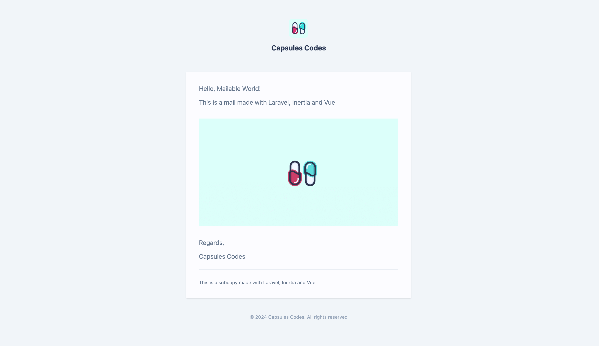

<p align="center"></p>

Seamlessly craft dynamic and reusable email templates using Inertia.

Inertia Mailable empowers you to build beautiful, component-driven emails in Laravel, utilizing the power of InertiaJS. Create interactive and responsive email designs effortlessly by composing Vue components and embedding them into your mailables.

<br>

 [This article](https://capsules.codes/en/blog/fyi/en-fyi-craft-emails-with-vue-and-tailwind-using-inertia-mailable) provides an in-depth exploration of the package.

<br>

> [!NOTE]
> This package is currently designed for Laravel and Vue users and is still in development.

<br>

## Installation

**1. Install package and publish expected inertia mailable file**

```bash
composer require capsulescodes/inertia-mailable

php artisan vendor:publish --tag=inertia-mailable-vue-js
```

<br>

It publishes two files :

 - `resources/js/mail.js` : base Inertia file
 - `resources/js/mails/Welcome.vue` : example Vue Component.

<br>

**2. Add filename into vite config's SSR array**

```javascript
plugins : [
    laravel( {
        ssr : [ ..., 'resources/js/mail.js' ],
    } )
```

<br>

**3. Add SSR to `build` script and build files**

`package.json`
```json
"scripts" : {
    "build" : "vite build && vite build --ssr"
},
```

```bash
npm run build
```

<br>

## Usage

```bash
php artisan make:mail InertiaMailableInstalled.php
```

<br>

`App\Mails\InertiaMailableInstalled.php`

```diff
<?php

namespace App\Mail;

- use Illuminate\Mail\Mailable;
+ use CapsulesCodes\InertiaMailable\Mail\Mailable;
use Illuminate\Mail\Mailables\Envelope;
use Illuminate\Mail\Mailables\Address;
- use Illuminate\Mail\Mailables\Content;
+ use CapsulesCodes\InertiaMailable\Mail\Mailables\Content;


class InertiaMailableInstalled extends Mailable
{
    private string $name;


    public function __construct( string $name )
    {
        $this->name = $name;
    }


    public function envelope() : Envelope
    {
        return new Envelope( from : new Address( 'example@example.com', 'Mailable World' ), subject : 'Hello Inertia Mailable World!' );
    }

    public function content() : Content
    {
-       return new Content( view: 'view.name' );
+       return new Content( view : 'Welcome', props : [ 'name' => $this->name ] );
    }

    public function attachments() : array
    {
        return [];
    }
}
```

<br>

`routes/web.php`

```php
<?php

use Illuminate\Support\Facades\Route;
use App\Mail\InertiaMailableInstalled;


Route::get( '/render', fn() => ( new InertiaMailableInstalled( "Mailable World" ) )->render() );
```

<br>

```bash
php artisan serve


INFO  Server running on [http://127.0.0.1:8000].
```

<br>

`> http://127.0.0.1:8000/render`

<p align="center"></p>

<br>

You are now ready to send.

<br>

`routes/web.php`

```php
<?php

use Illuminate\Support\Facades\Route;
use Illuminate\Support\Facades\Mail;
use App\Mail\InertiaMailableInstalled;


Route::get( '/send', function(){ Mail::to( 'example@example.com' )->send( new InertiaMailableInstalled( "Mailable World" ) ); } );
```
- replace 'example@example.com' with the desired email address in `routes/web.php`and `App\Mail\InertiaMailableInstalled.php`.

<br>
<br>

## Supported Frameworks

- [x] Inertia mailable supports Laravel.

<br>

- [x] Inertia Mailable supports Vue.
- [x] Inertia Mailable supports Vue with Typescript.
- [x] Inertia Mailable supports Vue with Tailwindcss.

<br>

## Options

**- Add a custom css file**

If you want to modify the current css file, publish the template and modify the path in the `inertia-mailable` config file.

```bash
php artisan vendor:publish --tag=inertia-mailable-css
```

<br>

`config.inertia-mailable.php`
```php

return [

    'css' => 'resources/css/custom-css.css'

];
```

<br>
<br>

**- Add a custom Tailwind config file**

If you want to use a custom tailwind config, modify the path in the `inertia-mailable` config file.

<br>

`config.inertia-mailable.php`
```php

return [

    'tailwind' => 'custom.tailwind.config.js'

];
```

<br>
<br>

**- Add a custom root blade view**

If you want to modify the current blade file, publish the template and modify the path in the `inertia-mailable` config file.

```bash
php artisan vendor:publish --tag=inertia-mailable-blade
```

<br>

`App\Mails\InertiaMailableInstalled.php`

```php
...

public function content() : Content
{
    return new Content( root : 'custom-blade-view', view : 'Welcome', props : [ 'name' => $this->name ] );
}

...
```

<br>
<br>

**- Specify the actual path to node**

If you encounter the following error : `Error: proc_open(): posix_spawn() failed: No such file or directory`, you will need to specify the actual path to Node.js. There is a dedicated environment variable for this.

<br>

`.env`

```
NODE_PATH=path/to/node
```

<br>
<br>

## Contributing

Pull requests are welcome. For major changes, please open an issue first to discuss what you would like to change.

Please make sure to update tests as appropriate.
In order to run MySQL tests, credentials have to be configured in the intended TestCases.

<br>

## Testing

```
composer test
```

<br>

## Credits

- [Capsules Codes](https://github.com/capsulescodes)

## License

[MIT](https://choosealicense.com/licenses/mit/)
