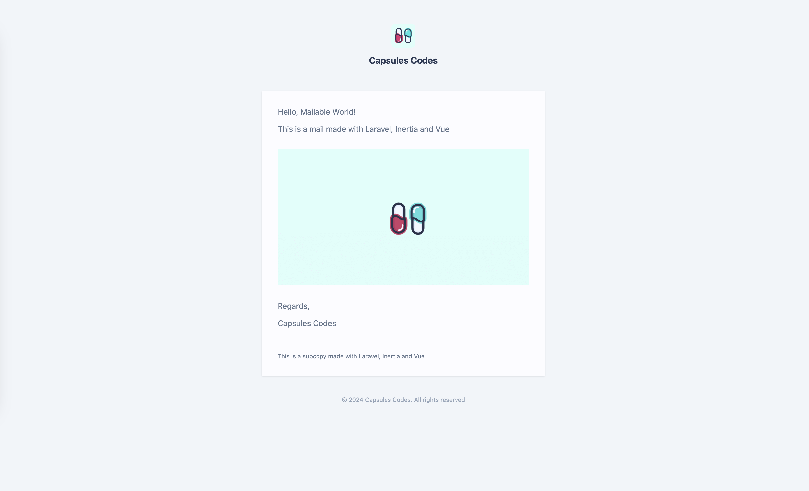

<p align="center"></p>

Seamlessly craft dynamic and reusable email templates using Inertia.

Inertia Mailable empowers you to build beautiful, component-driven emails in Laravel, utilizing the power of InertiaJS. Create interactive and responsive email designs effortlessly by composing Vue components and embedding them into your mailables. Streamline your email creation process while maintaining a consistent and modular design system across both web and email interfaces.

<br>

 [This article](https://capsules.codes/en/blog/fyi/en-fyi-build-emails-with-inertia-mailable) provides an in-depth exploration of the package.

<br>

## Installation

1. Install package and publish expected inertia mailable file [ vue-js, vue-ts ]

```bash
composer require capsulescodes/inertia-mailable

php artisan vendor:publish --tag=inertia-mailable-vue-js
```

<br>

2. Add filename into vite config's input array

```javascript
plugins : [
    laravel( {
        input : [ ..., 'resources/js/mail.js' ],
    } )
```

<br>

3. Build files

```
npm run build
```

<br>

## Usage

```
php artisan make:mail InertiaMailableInstalled.php
```

<br>

`App\Mails\InertiaMailableInstalled.php`

```diff
<?php

namespace App\Mail;

- use Illuminate\Mail\Mailable;
+ use CapsulesCodes\InertiaMailable\Mail\Mailable;
use Illuminate\Mail\Mailables\Envelope;
use Illuminate\Mail\Mailables\Address;
- use Illuminate\Mail\Mailables\Content;
+ use CapsulesCodes\InertiaMailable\Mail\Mailables\Content;


class InertiaMailableInstalled extends Mailable
{
    private string $name;


    public function __construct( string $name )
    {
        $this->name = $name;
    }


    public function envelope() : Envelope
    {
        return new Envelope( from : new Address( 'example@example.com', 'Mailable World' ), subject : 'Hello Inertia Mailable World!' );
    }

    public function content() : Content
    {
-       return new Content( view: 'view.name' );
+       return new Content( view : 'Welcome', props : [ 'name' => $this->name ] );
    }

    public function attachments() : array
    {
        return [];
    }
}
```

<br>

`routes/web.php`

```php
<?php

use Illuminate\Support\Facades\Route;
use App\Mail\InertiaMailableInstalled;
use Illuminate\Support\Facades\Mail;


Route::get( '/render', fn() => ( new InertiaMailableInstalled( "Mailable World" ) )->render() );

Route::get( '/send', function(){ Mail::to( 'example@example.com' )->send( new InertiaMailableInstalled( "Mailable World" ) ); } );
```

<br>

```
php artisan serve


INFO  Server running on [http://127.0.0.1:8000].
```

<br>

`> http://127.:8000/render`

<p align="center"></p>

<br>
<br>

## Supported Frameworks

- Vue Mailable supports Vue.
- Vue Mailable supports Vue with Typescript.
- Vue Mailable supports Vue with Tailwindcss.

<br>

## Contributing

Pull requests are welcome. For major changes, please open an issue first to discuss what you would like to change.

Please make sure to update tests as appropriate.
In order to run MySQL tests, credentials have to be configured in the intended TestCases.

<br>

## Testing

```
composer test
```

<br>

## Credits

- [Capsules Codes](https://github.com/capsulescodes)

## License

[MIT](https://choosealicense.com/licenses/mit/)
